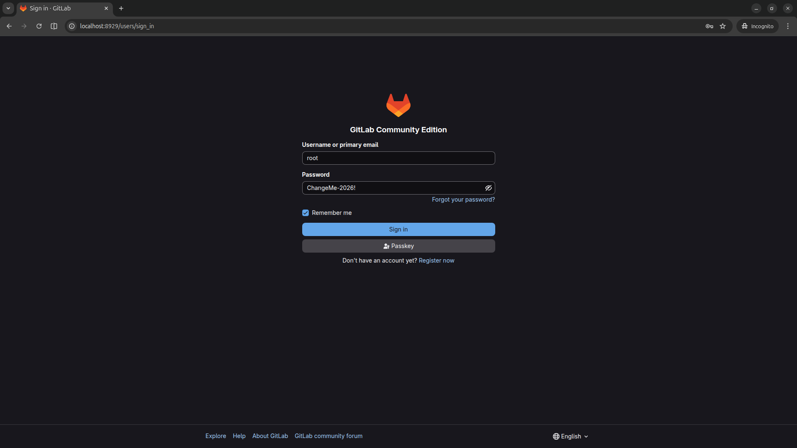
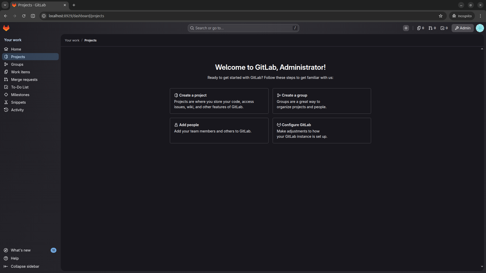
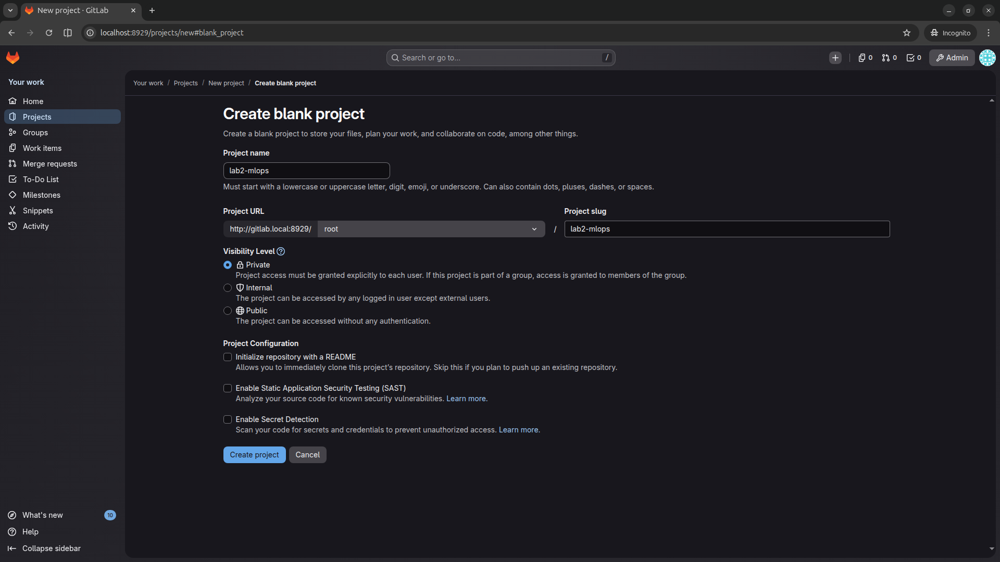
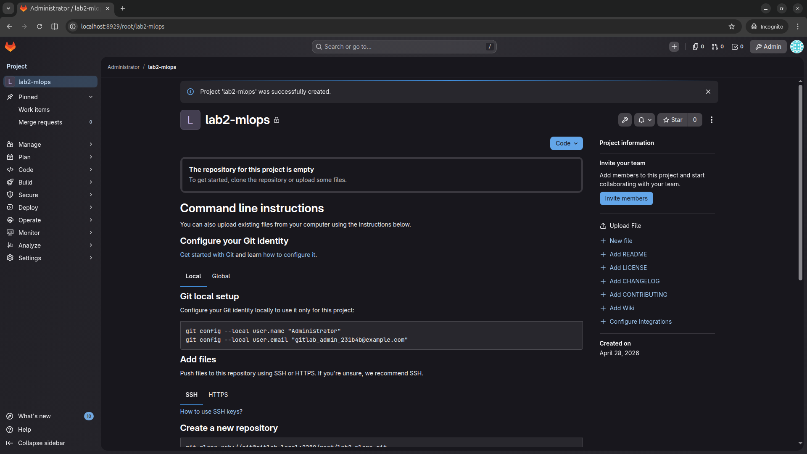
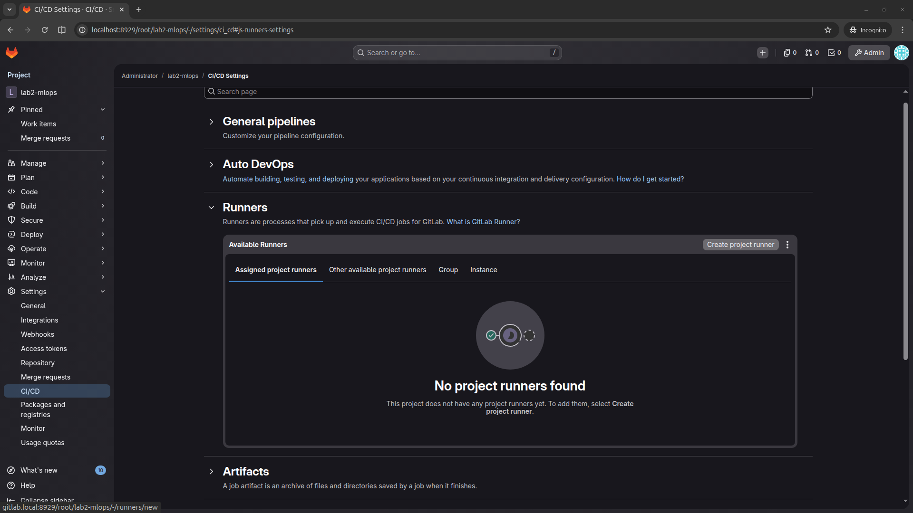
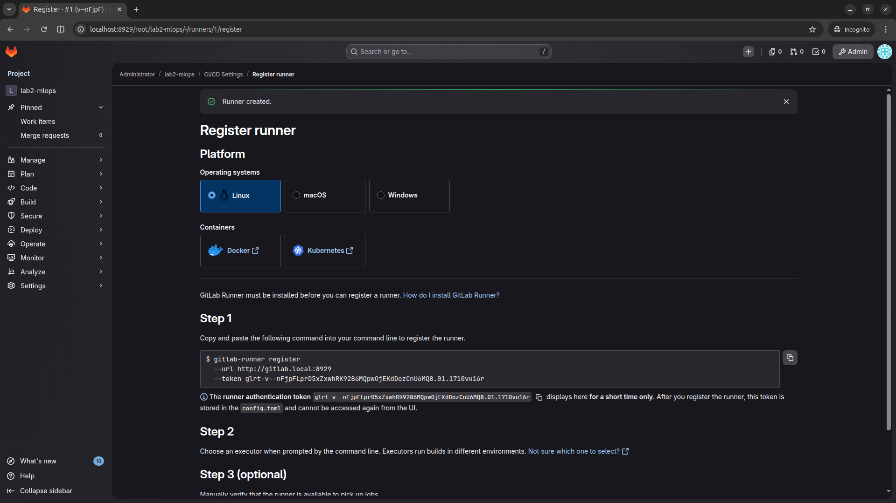
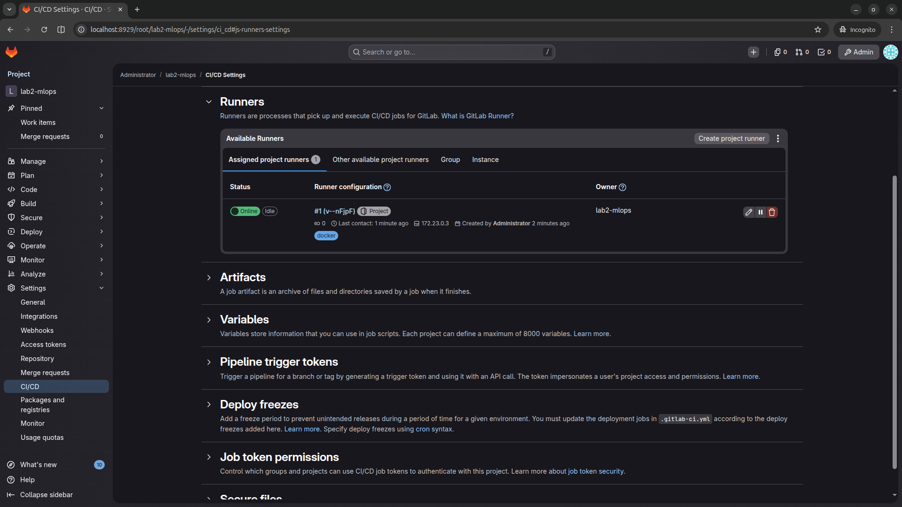
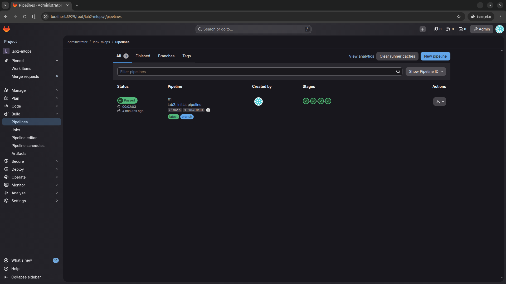
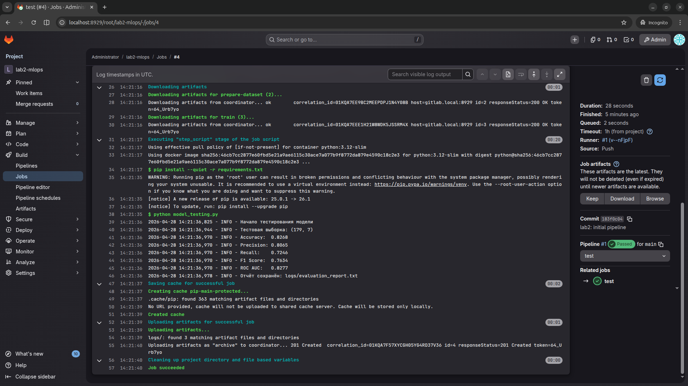
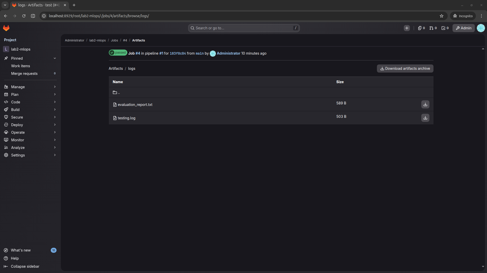

# Лабораторная работа №2 — CI/CD пайплайн для ML на Docker + GitLab

Студент разворачивает у себя локальный GitLab через Docker, регистрирует runner, собирает свой ML-пайплайн в `.gitlab-ci.yml` и прогоняет его в CI.

> **Что в этой папке — шаблон, а не готовое решение.**
> ML-скрипты (`data_collection.py`, `data_preprocessing.py`, `model_training.py`, `model_testing.py`) пишете вы сами по требованиям модуля 2 (см. корневой `README.md`). Они опираются на скрипты из lab1, которые уже у вас есть.
>
> Из коробки даны: инфраструктура локального GitLab (`gitlab-compose.yml`) и пример каркаса пайплайна (`.gitlab-ci.yml`, `Dockerfile`, `requirements.txt`) — адаптируйте под свой набор скриптов.

---

## Требования к пайплайну (что сдаётся)

В вашем `.gitlab-ci.yml` должны быть **минимум 3 обязательных стейджа**:

| Stage | Что должно происходить | Артефакт (рекомендуется) |
|-------|------------------------|--------------------------|
| `prepare-dataset` | Сбор и/или предобработка данных | `data/` |
| `train` | Обучение модели, сериализация в файл | `models/` |
| `test` | Прогон модели на тестовых данных, метрики | `logs/` или stdout |

---

## Структура папки

```
lab2/
├── README.md                   ← этот файл
├── Dockerfile                  ← пример образа python:3.12-slim + зависимости
├── .dockerignore
├── .gitignore                  ← исключает data/, logs/, models/
├── .gitlab-ci.yml              ← пример пайплайна: prepare-dataset → train → test
├── gitlab-compose.yml          ← локальный GitLab + Runner (НЕ часть проекта-лабы!)
└── requirements.txt            ← минимальный набор зависимостей (расширьте)
```

---

## Локальный прогон без GitLab (опционально)

Когда напишете свои скрипты — можно проверить пайплайн локально через Docker, без поднятия GitLab:

```bash
cd lab2
docker build -t lab2 .
docker run --rm -v "$(pwd)/_run:/app/_run" -w /app/_run lab2 bash -c "
  python /app/data_collection.py &&
  python /app/data_preprocessing.py &&
  python /app/model_training.py &&
  python /app/model_testing.py
"
```

Если всё отрабатывает — переходите к запуску в локальном GitLab.

---

# Запуск в локальном GitLab — основной путь сдачи

> **Нужен Docker.** Если ещё не установлен:
> [Docker Desktop](https://www.docker.com/products/docker-desktop/) (Windows/macOS) или
> `sudo apt install docker.io docker-compose-v2` (Ubuntu/Debian).
> Проверить: `docker --version && docker compose version`.
>
> **Потребуется ~4 ГБ RAM** для GitLab. Закройте тяжёлые приложения.

## Шаг 1. Поднять локальный GitLab

Скопируйте `gitlab-compose.yml` в **отдельную папку** (НЕ внутрь проекта-лабы), например `~/gitlab-local/`:

```bash
mkdir -p ~/gitlab-local && cp gitlab-compose.yml ~/gitlab-local/
cd ~/gitlab-local
```

Запустите:

```bash
docker compose -f gitlab-compose.yml up -d
docker compose -f gitlab-compose.yml logs -f gitlab
```

Ждите ~5 минут до строки `gitlab Reconfigured!`. Потом Ctrl+C — это просто выйдет из логов, GitLab продолжит работу.

Откройте http://localhost:8929. Должен открыться экран входа.



> Обратите внимание: поля **Username or primary email** и **Password** в центре. Логотип GitLab сверху.

## Шаг 2. Войти как root

- **Логин:** `root`
- **Пароль:** `ChangeMe-2026!` (задан в `gitlab-compose.yml`)

После входа вы окажетесь на главной странице GitLab.



> Обратите внимание: левое меню (Home / Projects / Groups / …) и кнопка **Admin** + аватарка в правом верхнем углу — значит вы вошли как root.

## Шаг 3. Создать новый проект

Меню слева → **Projects** → **New project** → **Create blank project**.

- Project name: `lab2-mlops`
- Visibility: **Private** (или Internal — не Public)
- **Снимите галку** «Initialize repository with a README» — мы зальём свои файлы.

Нажмите **Create project**.



> Обратите внимание: поле **Project name** = `lab2-mlops`, **Visibility Level** = Private (точка возле Private), под секцией **Project Configuration** галка **Initialize repository with a README** должна быть **снята**.

После создания GitLab покажет страницу проекта с инструкциями по push кода. Запомните URL вида `http://localhost:8929/root/lab2-mlops.git`.



> Обратите внимание: зелёный баннер «Project 'lab2-mlops' was successfully created», заголовок репозитория и блок **Command line instructions** с готовыми git-командами — `git remote add origin …` находится чуть ниже в этой же секции.

## Шаг 4. Зарегистрировать GitLab Runner

Runner — это процесс, который выполняет ваши job'ы. Он уже запущен в Docker (см. `gitlab-compose.yml`), но его нужно «привязать» к проекту.

### 4.1. Получить registration token

В вашем проекте: **Settings** (внизу слева) → **CI/CD** → секция **Runners** → **New project runner**.



> Обратите внимание: раздел **Runners** раскрыт, в правом верхнем углу секции — кнопка **Create project runner**. Жмём её.

Заполните форму:
- **Tags:** `docker` (одна метка, важно для соответствия с `.gitlab-ci.yml`)
- **Run untagged jobs:** ✓ включить
- остальное — по умолчанию

Нажмите **Create runner**. GitLab покажет токен вида `glrt-xxxxxxxxxx` — **скопируйте его**.



> Обратите внимание: в секции **Step 1** — команда `gitlab-runner register --url … --token glrt-…`. Скопируйте токен (`glrt-…`) — он понадобится в следующей команде.

### 4.2. Зарегистрировать runner-контейнер

В терминале (там же, где `gitlab-compose.yml`):

```bash
docker exec -it gitlab-runner gitlab-runner register \
  --non-interactive \
  --url http://gitlab:8929/ \
  --clone-url http://gitlab:8929/ \
  --token <ВАША_ТОКЕН_ИЗ_GITLAB> \
  --executor docker \
  --docker-image python:3.12-slim \
  --description "local-docker-runner" \
  --docker-network-mode gitlab-net
```

> Внутри docker-сети `gitlab-net` имя сервиса `gitlab` уже резолвится в нужный контейнер через docker-DNS — поэтому runner и спавненные им job-контейнеры обращаются к GitLab по `http://gitlab:8929/`. С хост-машины (браузер, `git push`) GitLab доступен по `http://localhost:8929/` через проброс порта.

Перезагрузите страницу Runners в GitLab — runner должен появиться со статусом «online» (зелёный кружок).



> Обратите внимание: в строке runner'а слева — зелёный кружок (статус **online**) и тег `docker`.

## Шаг 5. Залить код в проект

Подготовьте папку с вашим вариантом lab2: ваши ML-скрипты + адаптированный `.gitlab-ci.yml` + `Dockerfile` + `requirements.txt`. **Не кладите** туда `gitlab-compose.yml` — это инфраструктура, не часть проекта.

Инициализируйте git и push:

```bash
cd /путь/к/вашему/lab2
git init -b main
git add .
git commit -m "lab2: initial pipeline"
git remote add origin http://root@localhost:8929/root/lab2-mlops.git
git push -u origin main
# Пароль при push — тот же ChangeMe-2026!
```

GitLab сразу запустит pipeline. Перейдите в проект → **Build** → **Pipelines**.

## Шаг 6. Проверить результаты

Дождитесь завершения всех стейджей (~2-3 минуты на первом прогоне из-за `pip install`). Все должны быть зелёными:



> Обратите внимание: статус **Passed** (зелёный) и в колонке **Stages** — три зелёных кружка (`prepare-dataset`, `train`, `test`).

Кликните на job `test` → справа **Job artifacts** → **Browse** — увидите файлы артефактов (например, `logs/`, `models/`):



> Обратите внимание: в логе job `test` — строки с метриками (`Accuracy`, `Precision`, `Recall`, `F1 Score`, `ROC AUC`) и финальная строка `Job succeeded`.



> Обратите внимание: вверху бейдж `passed`, ниже — список файлов в `logs/`: `evaluation_report.txt` и `testing.log`. Каждый можно скачать кнопкой справа.

---

## Каркас `.gitlab-ci.yml` — что в каком stage

| Stage | Что | Артефакты (пример) |
|-------|-----|--------------------|
| `prepare-dataset` | Сбор + предобработка данных | `data/` |
| `train` | Обучение модели | `models/` |
| `test` | Метрики и отчёт | `logs/` |

`needs:` между job'ами выстраивает DAG, поэтому `train` дожидается `prepare-dataset`, `test` — обоих.

---

## Если что-то пошло не так

| Проблема | Решение |
|----------|---------|
| GitLab не открывается на 8929 | Подождите ещё минуту, GitLab инициализируется до 5 мин на первом старте |
| Runner offline в UI | Проверьте `docker logs gitlab-runner` |
| Job упал с `Could not resolve host: gitlab` | При регистрации runner забыли `--docker-network-mode gitlab-net`, перерегистрируйте |
| Job упал на `pip install` | Может тормозить сеть к pypi; перезапустите job (Retry) |
| Push спрашивает пароль и не принимает | Используйте логин `root` и пароль `ChangeMe-2026!` (можно поменять в Settings → Profile) |

---

## Сворачивание окружения

```bash
cd ~/gitlab-local
docker compose -f gitlab-compose.yml down          # выключить
docker compose -f gitlab-compose.yml down -v       # выключить и удалить ВСЕ данные GitLab
```
